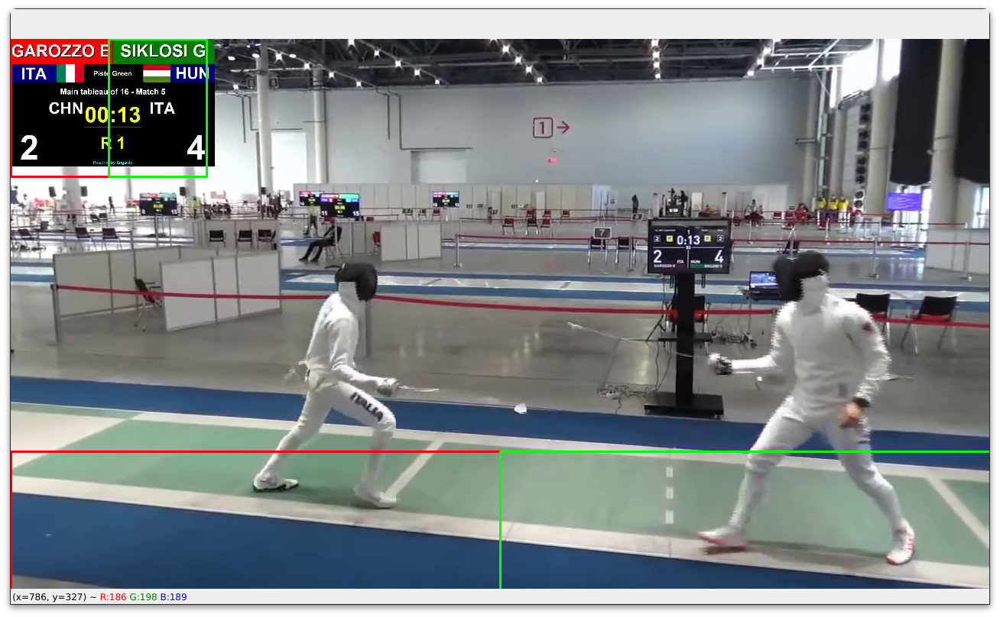

<div align="center">
    <h1>
        ffwf - Find Fencer Within Frame
    </h1>
    <p align="center">
        A Python script that detects the side of a fencer by their name in a given video
    </p>
    
</div>

## Introduction

ffwf (Find Fencer Within Frame) is a Python script that can automatically detect the side of a specified fencer in a fencing video, and add an arrow overlay to indicate which side they are on.
The script will work with most clips provided by [The Fencing Database](https://www.fencingdatabase.com/search).

This project was inspired by a video on YouTube (https://www.youtube.com/watch?v=Av04zK8Ed54) featuring a fencer named Nathalie Moellhausen, where an arrow was added to the video to indicate her side. The author mentioned in the comments that the whole process was automated, and I was curious to see if I could replicate this process using Python.

## How It Works

ffwf is a Python script that processes fencing videos to detect the fencer's name and side (left or right). It uses OpenCV, pytesseract, ffmpeg, and a few standard Python libraries to do this.

The script reads in each video file, then crops the frames to specific areas where the fencer's name is displayed (bottom left, bottom right, top left, and top left but slightly to the right), as shown in the images below (the red and green boxes indicate the cropped areas).

| Scoreboard at the bottom of the video                | Scoreboard at the top left of the video              |
| ---------------------------------------------------- | ---------------------------------------------------- |
|  |  |

OCR (Optical Character Recognition) is applied to each of these areas to extract the text, which is then compared to the fencer names provided as an argument. If the fencer name is detected in one of the areas, the script overlays an arrow image on the video indicating the fencer's side (left or right). Below are examples of the results produced by the script, when 'Max Heinzer' was given as the fencer name.

Unfortunately, OCR cannot always get a 100% match when detecting the fencer's name, for example, when searching for 'Gergely Siklosi' in a video where the name is displayed as 'SIKLOSI G'. The script will read 'siklosig' instead of splitting the name into two words ('siklosi' and 'g'). To get around this, we use some regular expressions to check if the extracted text contains the fencer's name. If it does, we assume that the fencer's name was detected. Fortunately for us, this will also speed up the process, since we don't need a exact match.

| Result Heinzer (left)                                    | Result Heinzer (right)                                     |
| -------------------------------------------------------- | ---------------------------------------------------------- |
|  |  |

These results are produced by the following command (as shown in the preview gif at the top of this README):

```console
$ python src/main.py --video ./in/Max\ Heinzer/max-heinzer-video-{4,14}.mp4 --name 'Max Heinzer'
```

Note that the `--video` argument is used to specify the video files that we want to process, and the `--name` argument specifies the name of the fencer whose side we want to indicate.

It is possible to use glob patterns to specify multiple video files, and we can also use multiple paths. The fencer's name can be given in any format, as long as the first and last name are separated by a space. For example, both 'Max Heinzer' and 'Heinzer Max' are valid inputs. The script will split the name into two parts and search for each part separately, increasing the chances of a match.

In addition to the `--video` and `--name` arguments, a third option is also available for the script: `--verbose`. This option is particularly useful when the script cannot find a match, as it will output all the words found in the cropped areas of the video. By enabling the `--verbose` flag, you can easily see the extracted text from each cropped area, allowing you to manually search for the fencer's name and check if it was correctly detected. This can be helpful in cases where the fencer's name is displayed in a non-standard format, or where the OCR has difficulty recognizing the text.

If the script is unable to detect the fencer's name within any of the specified areas, it will not overlay an arrow image on the video and will not output the video to the `out` directory. This means that videos where the fencer's name is not displayed in the expected areas will not be processed and no output will be generated. In this case, you can try adjusting the crop areas or using the `--verbose` option to see if the script is correctly extracting the text from the video frames.

## Requirements

The following software packages/libraries are required to run the script:

-   Python 3.x
-   Tesseract
    -   The path to the executable must be changed in the script, when running on Windows and macOS.
-   pytesseract
-   opencv-python
-   ffmpeg-python
-   standard Python libraries (os, sys, argparse, re)

The requirement python libraries can be installed using the following command:

```console
$ pip install -r requirements.txt
```

## Usage

Underneath you can find the usage information for the script. The `--video` and `--name` arguments are required, and the `--verbose` argument is optional.

```console
$ python main.py --help
usage: main.py [-h] --video VIDEO [VIDEO ...] --name NAME [--verbose]

FFWF - Find Fencer Within Frame

options:
  -h, --help            show this help message and exit
  --video VIDEO [VIDEO ...]
                        video file(s)
  --name NAME           fencer name(s)
  --verbose             debug mode
```

For example, to add an arrow indicating the side of fencer Gergely Siklosi in multiple video files, such as 'video1.mp4' and 'video2.mp4', you can use the following command:

```console
$ python main.py --video video1.mp4 video2.mp4 --name 'Gergely Siklosi'
```

**Note**: The name must be surrounded by quotes (e.g. 'Gergely Siklosi').

The script will create a new directory called `out` and save the processed videos in it.

## Contributing

If you have any suggestions or improvements, feel free to open an issue or a pull request.

## License

This project is licensed under the MIT License - see the [LICENSE.md](./LICENSE.md) file for details.
